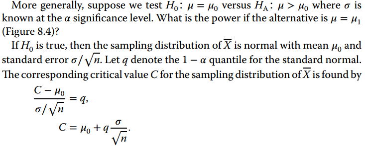
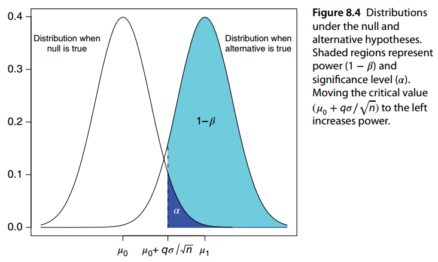
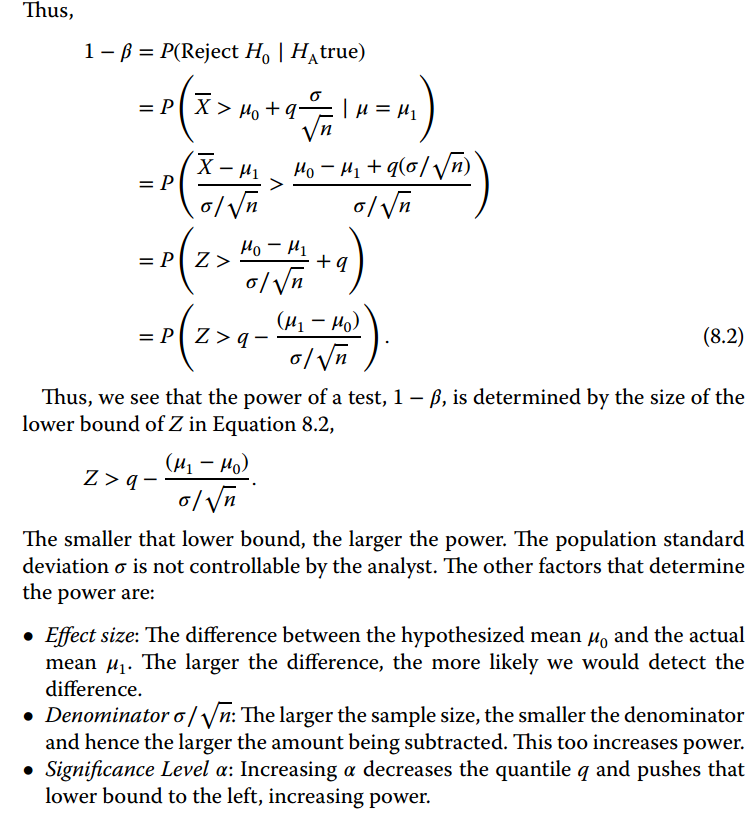

This notebook contains code and examples to extend or clarify some
topics from the "Advanced Statistical Inference" course.

# Using simulation to estimate properties of statistics

Simulation is often used to study sampling properties of estimators.

The example below compares three different estimators for the mean of a
distribution based on an iid sample of size n:

-   sample mean
-   20% trimmed mean (may work better with heavy tails...)
-   median (may not work well for asymmetric distributions...)

```{r}
#  function to view the first k lines of a data frame

view <- function(dat,k){

   message <- paste("First",k,"rows")
   krows <- dat[1:k,]
   cat(message,"\n","\n")
   print(krows)

}

#  function to calculate summary statistics across the 1000
#  data sets 

simsum <- function(dat,trueval){

   S <- nrow(dat)

   MCmean <- apply(dat,2,mean)
   MCbias <- MCmean-trueval
   MCrelbias <- MCbias/trueval
   MCstddev <- sqrt(apply(dat,2,var))
   MCMSE <- apply((dat-trueval)^2,2,mean)  
#   MCMSE <- MCbias^2 + MCstddev^2   # alternative lazy calculation
   MCRE <- MCMSE[1]/MCMSE

   sumdat <- rbind(rep(trueval,3),S,MCmean,MCbias,MCrelbias,MCstddev,MCMSE,
            MCRE)
   names <- c("true value","# sims","MC mean","MC bias","MC relative bias",
              "MC standard deviation","MC MSE","MC relative efficiency")
   ests <- c("Sample mean","Trimmed mean","Median")

   dimnames(sumdat) <- list(names,ests)
   round(sumdat,5)
}

#  function to generate S data sets of size n from normal
#  distribution with mean mu and variance sigma^2

generate.normal <- function(S,n,mu,sigma){
   
  dat <- matrix(rnorm(n*S,mu,sigma),ncol=n,byrow=T) 

#  Note: for this very simple data generation, we can get the data
#  in one step like this, which requires no looping.  In more complex
#  statistical models, looping is often required to set up each
#  data set, because the scenario is much more complicated.  Here is
#  a loop to get the same data as above; try running the program and see
#  how much longer it takes!

#  dat <- NULL
#
#   for (i in 1:S){
#
#      Y <- rnorm(n,mu,sigma)
#      dat <- rbind(dat,Y)
#
#   }

   out <- list(dat=dat)
   return(out)
}

#  function to generate S data sets of size n from gamma
#  distribution with mean mu, variance sigma^2 mu^2

generate.gamma <- function(S,n,mu,sigma){

   a <- 1/(sigma^2)
   s <- mu/a

   dat <- matrix(rgamma(n*S,shape=a,scale=s),ncol=n,byrow=T) 

#  Alternative loop

#   dat <- NULL
#
#   for (i in 1:S){
#
#      Y <- rgamma(n,shape=a,scale=s)
#      dat <- rbind(dat,Y)
#
#   }

   out <- list(dat=dat)
   return(out)
}

#  function to generate S data sets of size n from a t distribution
#  with df degrees of freedom centered at the value mu (a t distribution
#  has mean 0 and variance df/(df-2) for df>2)

generate.t <- function(S,n,mu,df){

    dat <- matrix(mu + rt(n*S,df),ncol=n,byrow=T) 

#   Alternative loop

#   dat <- NULL
#
#   for (i in 1:S){
#
#      Y <- mu + rt(n,df)
#      dat <- rbind(dat,Y)
#
#   }

   out <- list(dat=dat)
   return(out)
}
   

#  function to compute the 20% trimmed mean

trimmean <- function(Y){mean(Y,0.2)}
```

A possibly "fair" comparison would be to generate data from each of
these distributions with the same mean and variance and see how the
three methods perform on a relative basis under each condition.

```{r}
#  set the seed for the simulation

set.seed(3)

#  set number of simulated data sets and sample size

S <- 1000 

n <- 15

#  generate data  --Distribution choices are normal with mu,sigma
#  (rnorm), gamma (rgamma) and student t (rt)


mu <- 1
sigma <- sqrt(5/3)

#   out <- generate.normal(S,n,mu,sigma)  # generate normal samples
#  out <- generate.gamma(S,n,mu,sigma)  # generate gamma samples 
  out <- generate.t(S,n,mu,5)   # generate t_5 samples

#  get the sample means from each data set

outsampmean <- apply(out$dat,1,mean)

#  get the sample trimmed mean from each data set

outtrimmean <- apply(out$dat,1,trimmean)

#  get the sample median from each data set

outmedian <- apply(out$dat,1,median)

#  now we can summarize -- remember, mu is the true value of the mean
#  for the true distribution of the data

#  get the 1000 estimates for each method

summary.sim <- data.frame(mean=outsampmean,trim=outtrimmean,
           median=outmedian)

#  print out the first 5 of them (round to 4 decimal places)

view(round(summary.sim,4),5)

#  get summary statistics for each estimator

results <- simsum(summary.sim,mu)

results

#############################################################

#  Some additional calculation for the sample mean

#  average of estimated standard errors for sample mean

#  usual standard error for sample mean from each data set

sampmean.ses <- sqrt(apply(out$dat,1,var)/n)

#  take the average

ave.sampmeanses <- mean(sampmean.ses)

#  coverage of usual confidence interval based on sample mean

t05 <- qt(0.975,n-1)

coverage <- sum((outsampmean-t05*sampmean.ses <= mu) & 
          (outsampmean+t05*sampmean.ses >= mu))/S

coverage
```

# Investigating Convergence Concepts

## The law of large numbers

The LLN can be illustrated in the context of a sequence of iid Bernoulli
random variables.

We fix the parameter at p=0.3. We then consider a varying number n of
such random variables and the corresponding sums. We know that these are
binomial with parameters (n,p) The plot below draws, for each n, the
10-percentile and the 90-percentile of Bin(n,p).

```{r}
p = 0.3
n = 20*(1:50)
L = qbinom(0.10, n, p)/n
U = qbinom(0.90, n, p)/n
plot(n, rep(p, length(n)), type = "n", ylim = c(min(L), max(U)), xlab="n", ylab = "")
segments(n, L, n, U, lwd = 2, col = "black")
abline(h = p, lty = 2)
```

-   Where does this sequence converge to?
-   Does the plot suggest such convergence? Change it into a logarithmic
    scale.

```{r}
n = 2^(10:20)
L = qbinom(0.10, n, p)/n
U = qbinom(0.90, n, p)/n
plot(n, rep(p, length(n)), log = "x", type = "n", ylim = c(min(L), max(U)), xlab="n", ylab = "")
segments(n, L, n, U, lwd = 2, col = "black")
abline(h = p, lty = 2)
```

## The Central limit theorem

The Law of Large Numbers provides a first-order limit, which is
deterministic: The sequence of partial means converges to the mean of
the underlying distribution generating the random variables.

The Central Limit Theorem provides a second-order limit, which does not
exist in a deterministic sence, but does in the distributional sense:
The sequence of partial means, when standardized, converges in
distribution to the standard normal distribution. (This assumes that the
underlying distribution has finite second moment.)

To see this, we go back to the binomial example above, but we track down
multiple quantiles of the successive (standardized) binomial
distributions.

```{r}
p = 0.3
n = 20*(1:50)
Q = matrix(NA, 50, 9) # each row stores the quantiles of standardized binomial distribution
for (k in 1:50){
  Q[k, ] = (qbinom((1:9)/10, n[k], p) - n[k]*p)/sqrt(n[k]*p*(1-p))
}  
matplot(n, Q, type = "l", lty = 1, lwd = 2, col = 4, xlab = "n", ylab = "quantiles")
abline(h = qnorm((1:9)/10), lty = 2) # quantiles of the standard normal distribution
```

### The CLT and sampling distribution of the mean

A typical illustration of the CLT for the sample mean.

```{r}
datos<-list()
datos[[1]] <- matrix(runif(10000),nrow=1000)
datos[[2]] <- matrix(rexp(10000),nrow=1000)
datos[[3]] <- matrix(rnorm(10000),nrow=1000)
names(datos)<-c("Unifor","Exponential","Gaussian")
opt<-par(mfrow=c(3,3))
for (i in 1:3){
  x<-datos[[i]]
  m1<-x[,1]
  m2<-apply(x[,1:2],1,mean)
  m3<-apply(x,1,mean)
  hist(m1, 20, main=paste(names(datos)[i], "n=1", sep="\n"), cex.main=0.8);
  hist(m2, 20, main=paste(names(datos)[i], "n=2 (mean)", sep="\n"), cex.main=0.8)
  hist(m3, 20, main=paste(names(datos)[i], "n=10 (mean)", sep="\n"), cex.main=0.8)
}
```

Strictly speaking we are not illustrating the CLT here. What should we
do for a better illustration?

## On the difference between Convergence in Probability and Almost sure convergence

This is a simple analogy, found in Quora, that captures some aspects of the difference:

-Suppose we have a committee with 100 members.
- Imagine there is one meeting of the committee everyday throughout the year, and that we want to know about attendance on the committee.
  - Alost sure convergence is a bit like asking whether almost all members had perfect attendance.
  - Convergence in probability is a bit like asking whether all meetings were almost full.

- If almost all members have perfect attendance, then each meeting must be almost full (convergence almost surely implies convergence in probability)

- But if all meetings were nearly full, it isn't necessary that any member has perfect attendance (eg, each member might have been absent on one distinct day). Convergence in probability does not imply convergence almost surely.

Convergence almost surely means that $X_n(w)$ gets close to $X(w)$ as $n$ increases for almost all elements w of the sample space. It's a statement about convergence of $X_n(w)$ for many individual $w$.

Convergence in probability means that the set of elements $w$ of the sample space for which $X_n(w)$ is close to $X(w)$ has probability approaching 1. It's a statement about the size of the set of w which satisfy the closeness property, but not about any one w.

# The empirical distribution function

## Building the empirical distribution function

-   The empirical distribution function can be intuitively described
    through the following algorithm.

-   Take a sample and consider it "fixed"

-   Sort it

-   consider values x that go from $-\infty$ to $\infty$ or, simply,
    from below the smallest number (e.g. $min(X_0)-1$) to above the
    highest value (e.g.$max(x_0)+1$).

    -   Be sure to increase $x$ in such a way that the values in the
        sample will be "hit" by it,

-   Build two vectors as followss:

    -   $x_0=min(\mathbb{x_0})-1$
    -   $y_0 = 0$
    -   While $x_i< max(\mathbb{x_0})+1$ do
        -   $x_i+1 = x_i+\Delta$
        -   if $x_{i+1} \in \mathbb{x_0^{sorted}}$ then
            $y_{i+1}=y_i+\frac{1}{n}$

-   The values of $y$ form an approximation to the empirical cdf of
    $\mathbb{x_0}$

Implement an R function that generates the empirical distibution
function given a sample.

R has a function implemented that computes the ecdf.º

```{r}
x0<-c(0.4,-0.6, 1.8,0.5,-2.0, 0.7, -0.5, -1.1, -0.2,  -0.7)
Fn <- ecdf(x0)
round(Fn(sort(x0)), 2)
knots(Fn)
Fn(knots(Fn))
```

## Ploting the empirical cdf with R

Functions `ecdf` and `plot.ecdf` facilitate the visualization of the
empirical cdf.

```{r}
x0<-c(0.4,-0.6, 1.8,0.5,-2.0, 0.7, -0.5, -1.1, -0.2,  -0.7)
Fn <- ecdf(x0)
plot(Fn)
```


```{r}
op <- par(mfrow=c(3,1), mgp=c(1.5, 0.8,0), mar= .1+c(3,3,2,1))

set.seed(123)
x0 <- round(rnorm(12),3)
x0


Fn12 <- ecdf(x0)
summary(Fn12)

plot(Fn12)
plot(Fn12, verticals= TRUE, do.points = FALSE)

plot(Fn12 , lwd = 2) ; mtext("lwd = 2", adj=1)
xx <- unique(sort(c(seq(-3, 2, length=201), knots(Fn12))))
lines(xx, Fn12(xx), col='blue')
abline(v=knots(Fn12),lty=2,col='gray70')

plot(xx, Fn12(xx), type='o', cex=.1)#- plot.default {ugly}
plot(Fn12, col.hor='red', add= TRUE)  #- plot method
abline(v=knots(Fn12),lty=2,col='gray70')
## luxury plot
plot(Fn12, verticals=TRUE, col.points='blue',
     col.hor='red', col.vert='bisque')

##-- this works too (automatic call to  ecdf(.)):
plot.ecdf(rnorm(24))
title("via  simple  plot.ecdf(x)", adj=1)

par(op)

```

## Showing that $F_n()$ approximates $F()$

For the normal distribution

```{r}
op<-par(mfrow=c(2,2))
for(n in c(10, 20, 50, 100)){
  x<- sort(rnorm(n))
  plot.ecdf(x, main=paste ("Empirical cdf \n (Samples from N(0,1)), n=", n), cex.main=0.7)
  tcdf<- pnorm(x)
  lines(x,tcdf)
 }
par(op)
```

Or the uniform distribution

```{r}
op<-par(mfrow=c(2,2))
for(n in c(10, 20, 50, 100)){
  x<- sort(runif(n))
  plot.ecdf(x, main=paste ("Empirical cdf (Samples from U(0,1)), n=", n))
  tcdf<- punif(x)
  lines(x,tcdf)
 }
```

# The bootstrap

## Basic resampling (i): Standard error of the mean

```{r}

# Asignación de los datos a un vector
x <- c(94,197,16,38,99,141,23)
#Calculo de la media y de su error estandar
theta <- mean(x)
stderrtheta <- sqrt(var (x)/length(x))
#Visualizacion de la media y de su error estandar
cat("theta = " , theta,"\n")
cat("Error estandard de theta = " , stderrtheta,"\n")
# Preparacion del remuestreo
# Numero de remuestras
nboot<-100
# Creación de un vector en donde guardar las remuestras
distboot<- rep(NA,nboot)
# Remuestreo
for (b in 1:nboot)
   {x.boot<-sample(x,replace=T)
    distboot[b] <-mean (x.boot)
}
hist(distboot)

# Error estandar bootstrap
stderrboot <-sqrt(var(distboot))
#Visualizacion del error estandar bootstrap
cat("Error estandard bootstrap= " , stderrboot,"\n")
# Distribucion bootstrap
results<-summary(distboot)
print(results)
```

```{r}
bootstrapsSeMean <- function(x, B){
 res <- numeric(B)
 for(i in 1:B)
 res[i] <- mean(sample(x, replace=TRUE))
 res <- sd(res)
 return(res)
}
x <- c(94,197,16,38,99,141,23)
bootstrapsSeMean (x, 100)
```

## Basic resampling (ii): Standard error of the median

```{r}
bootstrapSeMedian <- function(x, B){
  res <- numeric(B)
  for(i in 1:B)
	 res[i] <- median(sample(x, replace=TRUE))
	 res <- sd(res)
	 return(res)
}
bootstrapSeMedian(x, 1000)
```

## The bootstrap distribution

The histogram of all estimations computed on all the resamples is an
approximation to the *bootstrap* distribution of the statistic.

```{r}
if (!require(bootstrap)) install.packages("bootstrap", dep=TRUE)
library(bootstrap) 
data('law')

set.seed(1)
theta <- function(ind) {
  cor(law[ind, 1], law[ind, 2], method = "pearson")
}

theta0 <- cor(law$LSAT, law$GPA)

# for(b in 1:5){
#   indiv<- sample(1:15, replace=TRUE)
#   show(t(resample <- law[indiv,]))
#   show(cor(resample)[1,2])
# }
law.boot <- bootstrap(1:15, 1000, theta) 
summary(law.boot)
```

An approximation to the bootstrap distribution.

```{r}
hist(law.boot$thetastar)
```

## Bootstrap confidence intervals

There are many ways to use the bootstrap to compute confidence
intervals.

The simplest one is assuming normality of the estimator and uise the
standard error to build normal confidence intervals:

```{r}
ci1 <- qnorm(p=c(.025, .975), 
            mean=theta0, 
            sd=sd(law.boot$thetastar))
ci1
```

The *bootstrap percentile* method relies on the quantiles of the
bootstrap distribution-

```{r}
quantile(law.boot$thetastar, c(0.025, 0.975))
```

For improved estimators it is preferable to use built-in functions such
as those available in packages `boot` or `bootstrap`

## Resampling with the `bootstrap` package

Programming the resampling process from scratch can be useful for a
better understanding but depending on the it may be slower, complex
(depending on the statistic to be bootstrapped) and often less
efficient.

Resampling packages allow an easier execution of the process and,
althoug they are more of the "black box" type, they should be the option
of choice for many problems.

Information on how to use some resampling packages can be found here

-   `boot`
    -   [Package
        site](https://cran.r-project.org/web/packages/boot/index.html)
    -   [A
        tutorial](https://www.datacamp.com/community/tutorials/bootstrap-r)
    -   [Another tutorial with
        references](https://www.statmethods.net/advstats/bootstrapping.html)
-   `resample`
    -   [Package site](https://rdrr.io/cran/resample/)
        -[Topics](https://www.rdocumentation.org/packages/resample/versions/0.4/topics)

## Example: Bootstraping a multivariate data set (Exercise U-2-I-9)

File `scores5.dat` contains the scores in 5 topics of 88 U.B. students.

1.  This data matrix has a $5 \times 5$ variance-covariance matrix with
    positive eigenvalues
    $\lambda_{1} >\lambda_{1} > \lambda_{2} > ... > \lambda_{5}$. Let
    $\theta$ be:
    $$\theta= \dfrac{\lambda_{1}} {\sum_{i=1}^{n} \lambda_{i}}.$$

$\theta$ is used to represent the percentage of variability explained by
the first principal component.

Let $\hat{\lambda_{1}} >\hat{\lambda_{2}} > ... > \hat{\lambda_{5}}$ be
the eigenvalues of $\widehat{\sum}$, the MLE of $\sum$. From here, by
the functional invariance principle of the MLE one has:
$$\hat{\theta}= \dfrac{\hat{\lambda_{1}}} {\sum_{i=1}^{n} \hat{\lambda_{i}}}$$
\### Describe how can one resample the data matrix to obtain an
approximation of the bootstrap distribution of $\hat{\theta}$. Using the
process derived above compute a bootstrap estimate of the standard error
of $\hat{\theta}$.

This is an scenario in which each observation is a multivariate random
vector of five components, which corresponds to each row of the data
matrix.

Resampling from the empirical distribution means resampling the data
matrix **by rows**, in order to maintain each original observation.

A bootstrap sample of the data matrix X would be a matrix $X_B$ with the
same dimensions than X whose rows would be randomly sampled with
replacement from the rows of $X$.

In this case, we will proceed as follows: Repeate B = 1000 times 1.
Create a newly resampled dataset by taking 5 samples with replacement of
the *whole* rows 2. Compute the covariance matrix on the resampled
dataset and then its eigen values $\lambda_{i}^b$, $i=1,...,5$ and then
$\hat{\theta}^b= \dfrac{\lambda_{1}^b} {\sum_{i} \lambda_{i}^b}$. 3.
Finally, we will compute the standard error of $\hat{\theta}$.

```{r}
datamatrix<-read.delim("scores5.dat")
covmatrix<-cov(datamatrix)
ev<-eigen(covmatrix)
evalues<-ev$values
theta <- evalues[1]/sum(evalues); theta
```

```{r}
set.seed(2)
n<-1000
distboot<- rep(NA,n)

for (i in 1:n){
  bootindexes <- sample ( nrow ( datamatrix ),replace = TRUE )
  bootmatrix <- datamatrix [ bootindexes ,]
  covmatrix1<-cov(bootmatrix)
  ev1<-eigen(covmatrix1)
  evalues1<-ev1$values
  distboot[i] <-evalues1[1]/sum(evalues1)
}

stderrboot <-sqrt(var(distboot)); stderrboot
```

### Provide a bias corrected estimate of $\theta$.

The bias of an estimator is defined as $$
b(\hat \theta) = E(\hat \theta)- \theta.
$$ Bias can be estimated using the bootstrap as folllows: Thinling of
the equivalence of "roles" between real world and bootstrap world we can
set

-   The role of $\theta$ is played by $\hat \theta$
-   The role of $E(\hat \theta)$ is played by
    $\widehat{E_B(\hat \theta)}$.
-   The bootstrap bias estimate is then $$
    b_B(\hat \theta) = \widehat{E_B(\hat \theta)}- \hat \theta.
    $$

And the bias corrected estimate of $\theta$ is

$$
\hat \theta_{BC} = \hat \theta -b_B(\hat \theta)  = 
2 \hat \theta- \widehat{E_B(\hat \theta)}.
$$

Finally recall that although these should be exact bootstrap estimates,
they can be approximated using Monte Carlo resampling and taking the
mean of the resampled vvalues.

$$
\widehat{E_B(\hat \theta)} \simeq \frac 1B \sum_{b=1}^B \hat \theta^b
$$ In our example we would simply do:

```{r}
Etheta <- mean(distboot);Etheta
theta <- evalues[1]/sum(evalues);theta
btheta<- Etheta - theta; btheta
thetaCB <- 2 *theta - Etheta; thetaCB
```

Notice that **all results are very similar**. That is in spite of how
"reasonable" the approach may seem we may need some theoretical results
or some simluation analysis to decide up to what point the bias
adjustment improves the estimator.

# Hypothesis tests, power function and sample size

## Power function

Given a test of simple hypotheses $H_0: \theta=\theta_0$, vs
$H_1:\, \theta=\theta_1$ about a parameter $\theta$, with *critical
(rejection) region* $W$,

-   The power of the test is the probability to correctly reject the
    null hypotheis, that is the probability of finding a sample in the
    critical region under the alternative hypothesis. $$
    \beta = \mbox{Power} = P\{X\in W| H_1\}.
    $$
-   If $H_1$ is compound, and there is a range of possible values for
    $\theta$, the power function gives the power of the test as a
    function of $\theta$: $Power=\beta(\theta)$.

For example: Given a sample of a binomial distribution where: $n=10$,
whch we want to use to test the hypotheses : $p=0.2$ vs $p>0.2$, the
critical region with size $\alpha < 0.05$ is es
$W=\{ x \in \{4, 5, 6, 7, 8, 9, 10\}\}$ because:

```{r}
probsacum <- pbinom(0:10, size=10, prob=0.2)
names(probsacum)<-0:10
print(round(probsacum,3))
```

The power function is just: $\beta(p)=P_p(W)=P_p(X \geq 4)$ which can be
plotted doing:

```{r}
probabs <- seq(0,1,by=0.01)
potenc <- 1-pbinom(4, size=10, prob=probabs)
plot (probabs,potenc, main="Funcion de potencia")
abline(v=0.2); abline(h=1- pbinom(4, size=10, prob=0.2))
```

## The power of a test

A simple way to define the power of a test isthe probability of the
critical region under the alternative hypothesis.

In simple cases it is possible to calculate this power analytically or
using R functions such as: `power.t.test` or related.

For example, suppose we wish to study a drug that lowers blood pressure.
We have 50 people in a control group and 50 in a treated group and we
expect the pressure to have a mean value of 150 (mmHg) and a deviation
of 15 mmHg in the control group, and to be *at least 10mmHg lower* in
the treated group.

With this information we can now calculate the power function for a
sample size (n) and a given effect size or minimum difference ("delta").

```{r}
power.t.test(n=50,
             delta=10,
             sd=15,
             sig.level=0.01, 
             power=NULL,
             type="two.sample",
             alternative="one.sided")
```

## Sample size

Given that power and sample size are usually inversely related, the same
function can be used to find the sample size required to reach a certain
power ("power"), given the values of the effect size ("delta"), standard
deviation ("sd") and significance level ("sig.level").

To compute $n$ here, set this parameter to "NULL" and assign values to
all the remaining parameters.

```{r}
power.t.test(n=NULL,
             delta=10,
             sd=15,
             sig.level=0.01, 
             power=0.95,
             type="two.sample",
             alternative="one.sided")
```

Imagine now (Exercise 1.2.4) you are required to find the sample size
needed to have a 95% chance of rejecting $H_0:\, \mu = 0$ vs
$H_1: \mu >0$ at $\alpha = 0.01$ if the true change is 1.5 sec. decrease
in time. 

Assuming the standard deviation is 3, and has been estimated, Chiara and Hesterberg (Mathematical Statistics wirth Resampling and R) provide the following ex`planation:

```{r}
power.t.test(n=NULL,
             delta=1.5,
             sd=3,
             sig.level=0.01, 
             power=0.95,
             type="one.sample",
             alternative="one.sided")
```

```{r, echo=FALSE,  out.width="100%"}

```
```{r, echo=FALSE,  out.width="100%"}

```
```{r, echo=FALSE,  out.width="100%"}

```


# Introducing permutation tests

One of the most common problems with statistical inference is not being
able to verify some assumptions of the assumed model for the data, such
as normality.

In these cases, it is usual to consider different alternatives such as
non-parametric tests, (which is usually labeled as having little power)
or permutations tests.

The logic of a permutations test, which we introduce in a simplified way
for the case of a two-group comparison problem, is as follows:

- Suppose we have obtained two samples of $ n_1 $ observations from a first group and $ n_2 $ observations of a second group respectively.
- To estimate the p-value of a hypotesis test:
  $H_o:\, \mu_1 = \mu_2$ versus $H_1:\, \mu_1 \neq \mu_2$ we must know the
  probability distribution of the test statistic, which can be
  the same as that of the two-sample t-test, under the null hypothesis.
- Now, we need to realize that, if the null hypothesis were true, the labels we have assigned to individuals as belonging to group 1 and group 2 _have no reason to be_ since all would belong to the same group and would have been left by chance in the sample that we have considered of the first group or that we have considered of the second.
-  One way to evaluate to what extent this has been so is the following:

  1. Consider all possible permutations of the two samples
  2. On each permutation, the separation between group 1 and group 2 will be performed (for example, the first $n_1$ elements of the permuted sample are assigned to group 1 and the remainder to group 2).
  3. After reallocation, the value of the test statistic is calculated.

The values of the test statistics calculated on all permutations constitute an approximation to the \emph {the distribution of the test statistic under the null hypotesis (that is: _there are not two groups but one_)}
so the p-value of the test can be calculated as:

$$
\begin {align*}
p & =  P_ {H_0} \left [T \left (\mathbf {X_1}, \mathbf {X_2} \right) \geq T \left (\mathbf {x_1 ^ 0}, \mathbf {x_2 ^ 0} \right) \right] \\
& \simeq \frac {\# T \left (\mathbf {X_1}, \mathbf {X_2} \right) \geq T
\left (\mathbf {x_1 ^ 0}, \mathbf {x_2 ^ 0} \right)} {\mbox {Number of
permutations}}
\end {align*}
$$
_In practice, the number of permutations is usually very large, so the above process is carried out in an approximate way, taking a smaller number of random permutations_.

The figure below illustrates the procedure used in a permutations test
to compare two samples.

```{r, echo=FALSE, out.width="100%"}
knitr::include_graphics("images/permutationtests.png")
```

## Example

We You want to compare the mean survival time in weeks of two groups of
mice affected by liver disease that have been treated with a drug ($z$)
or a placebo ($y$).

The values obtained have been:

```{=tex}
\begin {align *}
z & = & 94, 197, 16, 38, 99, 141, 23 \\
y & = & 52, 104, 146, 10, 51, 30, 40, 27, 46.
\end {align *}
```
-   Implement a permutation test as described above to compare the means
    of the two groups, using a two-sample t-statistic as a test
    statistic.
-   Apply the implemented test to compare the obtained values. Base the
    estimate of the p-value on 10,000 random permutations.
-   In case you don't want to use a permutation test, what would be an
    alternative reasonable approach?
-   Compare the results obtained with the alternative suggested with
    those of the permutation tests. Which one do you think is more
    appropriate in this case? What are the advantages or disadvantages
    of each of them?

### Building a permutations distribution

```{r}
tr <- c( 94, 197, 16, 38, 99, 141, 23)
y <- c( 52, 104, 146, 10, 51, 30, 40, 27, 46)
testInSample<- mean(tr) - mean(y)
```

The difference in means is `{r} testInSample`

To obtain a single permutation of the data, we combine the data and then
sample without replacement two "mock" tr and y vectors.

```{r}
testFun<- function(x1,x2){
  mean(x2)-mean(x1)
}
nt<- length(tr)
ny<- length(y)
N<- nt+ny
s <- sample(c(tr, y), N, FALSE)
trp <- s[1:nt]
yp <- s[(nt+1):N]
testFun(yp, trp)
```

If we repeat this process a large number of times, we can build our
approximate permutation distribution (i.e., the sampling distribution
for the mean-difference).

The result will be a vector of the differences from each permutation
(i.e., our distribution):

```{r}
NPerm <- 2000
testValues <- numeric(NPerm)
for (i in 1:NPerm){
  permutedS<- sample(s, N, FALSE)
  trp <- permutedS[1:nt]
  yp <- permutedS[(nt+1):N]
  testValues[i]<- testFun(yp, trp)
}
summary(testValues)
```

We can look at our distribution using hist and draw a vertical line for
our observed difference:

```{r}
par(mfrow=c(1,1))
hist(testValues)
abline(v = testInSample, col = "blue", lwd = 2)
```

A rough estimation of the permutation p-value, based on the formula above is

```{r}
sum(testValues >= testInSample)/length(testValues)
```

That is, in this example **we would not reject $H_0$ based on the results of the permutation test performed**.

### Relying on pre-built packages

We don't always need to build our own permutation distributions (though
it is good to know how to do it). R provides a package to conduct
permutation tests called coin. We can compare our p-value (and
associated inference) from above with the result from `coin`.

# The delta method

This example is taken directly from the practrical part from the
excelent tutorial on the delta method available at: [Delta Method in
Epidemiology: An Applied and Reproducible
Tutorial](https://migariane.github.io/DeltaMethodEpiTutorial.nb.html)

To illustrate the use of the delta-method the authors simulate data
based on a cancer epidemiology example.

The goal is to estimate the effect of the presence of comorbidities
(binary indicator) on one-year cancer mortality in cancer patients
controlling for the confounding effect of age in a cohort of 1,000
individuals in their middle age.

It is assumed that it is an extremely lethal type of cancer (i.e.,
pancreatic cancer) thus they can expect high one-year mortality rate. -
Age in years was generated as a normal random variable with mean 65
years and standard deviation of 5 years. - Comorbidities was generated
as a binary indicator and as a function of age using a binomial model. -
Patients one-year mortality rate was generated as a function of the
patients age and the presence of comorbidities using a binomial
distribution.

The data generation and models specifications are provide here below

```{r}
library(dplyr)
generateData <- function(n, seed){
    set.seed(seed)
    age <- rnorm(n, 65, 5)
    cmbd <- rbinom(n, size=1, prob = plogis(1 - 0.05 * age))
    Y <- rbinom(n, size=1, prob = plogis(1 - 0.02* age - 0.02 * cmbd))
    data.frame(Y, cmbd, age)
}

# Describing the data
data <- generateData(n = 1000, seed = 777) 
str(data)
summarize(
  data,
  Status = mean(Y), 
  Comorbidities = mean(cmbd),
  Age =  mean(age)) 
```

## Delta-method for a single proportion parameter

As a simple first example they derive the SE for the single probability
or risk of death using the delta-method.

In the code below, we compute the risk or probability of death based on
the empirical sample proportion and its variance. We define the
probability of death as the functional $f(p) =\hat p$ and its variance
is a known quantity: $$
var (\hat p) =\frac{\hat p (1-\hat p)}n
$$ Compute it with the simulated data:

```{r}
# Risk of death
p_hat = mean(data$Y)
print(p_hat)

# Variance for the risk of death
 n = nrow(data)
 var_p_hat = p_hat * (1 - p_hat) / n
 print(var_p_hat)

# Standard error estimate
se_exact <- sqrt(var_p_hat)
print(se_exact)
```

In order to compare the exact standard error estimate with the the delta
method estimate we only need to recall that, **in this case**, the first
derivative of f is equal to one. So the variance of the risk of death
can be estimated using:

$$
var_{\Delta}(f(\hat p) )= [f'(p)]^2 var(\hat p)=1\cdot var(\hat p)
$$ This yields the following naïve estimate:

```{r}
dev_p_hat = 1
se_risk = sqrt((dev_p_hat) * var_p_hat)
print(se_risk)
```

While it is not needed in this case the delta method estimate of the
risk can be computed used the `msm` package.

```{r}
# To check that our results are consistent with the implementation of the
# delta-method function provide by the sms R package used for
# advanced Geographical Analysis.
if (!require(msm)) install.packages("msm")
library(msm)
se_risk_delta = deltamethod(g = ~ x1, 
                            mean = p_hat,         
                            cov  = var_p_hat)
print(se_risk_delta)

## Are the same se_risk and se_risk_delta?
if(se_risk == se_risk_delta) print("Yes")
```

## Comparison with the bootstrap standard error

```{r}
library(boot)
thetahat <- function(dat,ind){
  dt <- dat[ind]
  phat <- mean(dt)
}
```

```{r}
myBootstrap <- boot(data$Y, thetahat, R=100)
se_risk_boot <- sd(myBootstrap$t)
```

We can now compare the three estimates of standard error:

```{r}
cat("Standard error for proportion estimates.\n")
cat("Analytical   : ", "\t", se_exact, "\n")
cat("Delta Method : ", "\t", se_risk_delta, "\n")
cat("Bootstrap    : ", "\t", se_risk_boot, "\n")
```

## Exercises

-   Extend the previous code to provide a delta method estimate for the
    statistic $\hat p (1-\hat p)$.
-   Compute a bootstrap standard error estimate and compare it with the
    previous one.

This document illustrates some of the computations seen in the document
"Numerical Optimization of Likelihoods".

<!-- All scripts are available at the url: [http://folk.uio.no/geirs/STK2120/R_opti/](http://folk.uio.no/geirs/STK2120/R_opti/) -->

# Numerical methods for maximum-likelihood estimation

## Plotting likelihood functions

Most statistical software allows plotting densities but not likelihood
functions.

Usually, in order to work with likelihoods we will write some function
that implements it, although there are alternatives.

Assume by example the gamma distribution $f(x;\alpha,\beta)$ with shape
and scale parameters $a$ (or $\alpha$) and $s$ (or $\beta$)
respectively: $$
   f(x;\alpha,\beta)= 1/(\beta^\alpha \Gamma(\alpha)) x^{(\alpha-1)} e^{-(x/\beta)}.
$$

If we restrict to the distribution with scale parameter $\beta=1$ we
have: $$
   f(x;\alpha)= 1/\Gamma(\alpha) x^{(\alpha-1)} e^{-x}.
$$

From above, the likelihood function can be derived as: $$
   L(\alpha|(x_1,...,x_n))= -n\cdot \ln (\Gamma(\alpha)) +(\alpha-1) \sum_{i=1}^n \ln x_i - \sum_{i=1}^n x_i.
$$

We can write a function implementing this likelihoos or use the one
available in R.

```{r loglik1}
logl <- function(alpha, x)
    return(sum(dgamma(x, shape = alpha, log = TRUE)))
```

or, in a better version:

```{r loglik2}
logl <- function(alpha, x) {
    if (length(alpha) > 1) stop("alpha must be scalar")
    if (alpha <= 0) stop("alpha must be positive")
    return(sum(dgamma(x, shape = alpha, log = TRUE)))
}
```

### Plotting the likelihood

The code below shows how to plot the likelihood for a sample, given
$\beta=1$

```{r plotLike1}

x <- rgamma(10, shape=1)

fred <- function(alpha)
    return(apply(as.matrix(alpha), 1, logl, x = x))
curve(fred, from = min(x), to = max(x),
    xlab = expression(alpha), ylab = expression(l(alpha)))
```

### Animated likelihoods

The `asbio` package, associated with the book *Foundational and Applied
Statistics for Biologists using R*, by Ken Aho provides a variety of
animated plots to illustrate concepts related to likelihoods.

These can be drawn using the `anm.loglik` function.

```{r eval=FALSE}
# install.packages("asbio")
## Not run: 
##Normal log likelihood estimation of mu.

library(asbio)
X<-c(11.2,10.8,9.0,12.4,12.1,10.3,10.4,10.6,9.3,11.8)

anm.loglik(X, dist="norm", parameter="mu")

##Add a plot describing log-likelihood calculation.
anm.loglik(X,dist="norm", parameter="mu",plot.calc=TRUE)

```

### More on plotting likelihoods and log-likelihoods

If we wish to obtain a numerical approximation to the MLE we will
usually need to write functions for

-   The (log-)likelihood
-   The gradient, that is the first derivatives
-   The Hessian that is the 2nd derivatives

Depending on which method and algorithms we use we will be required to
provide the first and perhaops one or two of the other functions.

The following code illustrates how to compute and plot the likelihood
and log-likelihood functions for the gamma distribution, which is used
to model the rainfall data in the text.

```{r}
x = scan("ILLRAIN.DAT",na.strings="*")
x = x[!is.na(x)]
alpha = seq(0.35,0.55,0.005);lambda = seq(1,3,0.05)
loglik = matrix(nrow=length(alpha),ncol=length(lambda))
n = length(x);sumx=sum(x);sumlogx = sum(log(x));
for(i in 1:length(alpha))
  for(j in 1:length(lambda))
  loglik[i,j] = n*alpha[i]*log(lambda[j])+(alpha[i]-1)*sumlogx-
              lambda[j]*sumx-n*log(gamma(alpha[i]))

image(alpha,lambda,exp(loglik),col=gray((0:32)/32))
persp(alpha,lambda,exp(loglik),theta=330,phi=45,shade=1,zlab="lik")

image(alpha,lambda,loglik,col=gray((0:32)/32))
persp(alpha,lambda,loglik,theta=330,phi=45,shade=1,zlab="l")
```

## Quadratic approximation for a likelihood

```{r}
plot_gamma_likelihood <- function(xmin = 2, xmax = 3,
                                  alpha0 = 2.3,
                                  n = 50,
                                  alpha_true = 5, lambda_true = 2,
                                  posLegend="topleft") {
  
  # ============================
  # 1. Mostra Gamma
  # ============================
  set.seed(123)
  x <- rgamma(n, shape = alpha_true, rate = lambda_true)
  
  sumlogx <- sum(log(x))
  sumx    <- sum(x)
  
  # ============================
  # 2. Log-versemblança vectoritzada
  # ============================
  loglik <- function(alpha) {
    out <- rep(NA, length(alpha))
    ok <- alpha > 0
    out[ok] <- n*alpha[ok]*log(lambda_true) +
      (alpha[ok] - 1)*sumlogx -
      lambda_true*sumx -
      n*lgamma(alpha[ok])
    out
  }
  
  # ============================
  # 3. Derivades numèriques
  # ============================
  loglik1 <- function(a) {
    h <- 1e-5
    (loglik(a + h) - loglik(a - h)) / (2*h)
  }
  
  loglik2 <- function(a) {
    h <- 1e-5
    (loglik(a + h) - 2*loglik(a) + loglik(a - h)) / h^2
  }
  
  # ============================
  # 4. Aproximació quadràtica
  # ============================
  loglik_taylor <- function(alpha) {
    loglik(alpha0) +
      loglik1(alpha0) * (alpha - alpha0) +
      0.5 * loglik2(alpha0) * (alpha - alpha0)^2
  }
  
  # ============================
  # 5. Rang de representació
  # ============================
  alpha_seq <- seq(xmin, xmax, length.out = 400)
  
  # ============================
  # 6. Gràfic principal (sense eixos)
  # ============================
  plot(alpha_seq, loglik(alpha_seq), type="l", lwd=2,
       xlab="alpha", ylab="log-likelihood",
       xaxt="n", yaxt="n",
       main = paste0("Gamma likelihood & quadratic approx (", xmin, ", ", xmax, ")"))
  
  lines(alpha_seq, loglik_taylor(alpha_seq),
        col="blue", lwd=2, lty=2)
  
  legend(posLegend,
         legend=c("Log-lik", "Quadratic"),
         col=c("black","blue"), lwd=2, lty=c(1,2))
  
  # Return useful objects for later additions
  list(
    loglik = loglik,
    loglik_taylor = loglik_taylor
  )
}

```

```{r}
res <- plot_gamma_likelihood(xmin=2.4, xmax=2.7, 
                             alpha_true = 3.05, lambda_true = 2.0,
                             posLegend="topleft")

loglik <- res$loglik
loglik_taylor <- res$loglik_taylor

xmin=2.4; xmax=2.7
axis(side = 1,
     at = seq(xmin, xmax, by = 0.1),
     labels = seq(xmin, xmax, by = 0.1))

# -------------------------
# Dibuixar línies verticals
# -------------------------

# 1) θ^0
x0 <- 2.45
segments(x0, par("usr")[3], x0, loglik_taylor(x0),
         col="black", lwd=2, lty=3)
text(x0, par("usr")[3], expression(theta^0), pos=1, xpd=TRUE)

# 2) θ_opt
xopt <- 2.54
segments(xopt, par("usr")[3], xopt, loglik(xopt),
         col="red", lwd=2)
text(xopt, par("usr")[3], expression(theta[opt]), pos=1, xpd=TRUE)

# 3) θ_1
x1 <- 2.525
segments(x1, par("usr")[3], x1, loglik_taylor(x1),
         col="blue", lwd=2, lty=2)
text(x1, par("usr")[3], expression(theta[1]), pos=1, xpd=TRUE)

```


## Muon-decay-Example

### The Newton-Raphson algorithm

The following function implements the Newton Raphson algorithm for the
muon-decay example:

```{r}
nr.muon <- function(x,alpha0=0.6,eps=0.000001)# ,l, s, Jbar)
{
n = length(x)
diff = 1;
alpha = alpha0;
l = sum(log(1+alpha*x))-n*log(2) # l<-l(x. alpha)
lJ <- numeric(); lJ[1] <- NA
lalpha <-numeric(); lalpha[1]<- alpha
while(diff>eps)
{
  alpha.old = alpha
  s = sum(x/(1+alpha*x))
  Jbar = sum((x/(1+alpha*x))^2)
  alpha = alpha+s/Jbar
  l = sum(log(1+alpha*x))-n*log(2)
  lalpha <- c(lalpha, alpha)
  lJ <- c(lJ, Jbar)
  diff = abs(alpha-alpha.old)
}
list(alpha=lalpha,l=lJ)
}
```

This can be used with simulated data:

```{r}
xMuon<- c(0.41040018, 0.91061564, -0.61106896, 0.39736684, 0.37997637,
      0.34565436,0.01906680, -0.28765977, -0.33169289, 0.99989810,
      -0.35203164, 0.10360470,0.30573300, 0.75283842, -0.33736278,
      -0.91455101, -0.76222116, 0.27150040,-0.01257456, 0.68492778,
      -0.72343908, 0.45530570, 0.86249107, 0.52578673, 0.14145264,
      0.76645754, -0.65536275, 0.12497668, 0.74971197, 0.53839119)
```

```{r}
results <- nr.muon (xMuon,alpha0=0.6,eps=0.000001)
df <- data.frame(iteration=1:length(results[[1]])-1, 
                 alpha=results[[1]], J=results[[2]])
show(df)
```

### Modularizing the code

An improved version of the previous procedire can make it easier to apply to other functions.

```{r}
# lo-likelihood
log_likelihood <- function(alpha, x) {
  n <- length(x)
  sum(log(1 + alpha * x)) - n * log(2)
}

# First derivative (gradient)
log_likelihood_prime <- function(alpha, x) {
  sum(x / (1 + alpha * x))
}

# Second derivative (hessian)
log_likelihood_double_prime <- function(alpha, x) {
  sum((x / (1 + alpha * x))^2)
}

# Running Newton-Raphson

newton_raphson <- function(x, log_lik_fn, grad_fn, hess_fn, alpha0 = 0.6, eps = 1e-6) {
  n <- length(x)
  diff <- 1
  alpha <- alpha0
  iter <- 0
  
  # Inicializamos resultados
  alpha_history <- numeric()
  log_likelihood_history <- numeric()
  alpha_history[1] <- alpha
  log_likelihood_history[1] <- log_lik_fn(alpha, x)
  
  while (diff > eps) {
    iter <- iter + 1
    grad <- grad_fn(alpha, x)
    hess <- hess_fn(alpha, x)
    
    # Actualizar alpha
    alpha_new <- alpha + grad / hess
    diff <- abs(alpha_new - alpha)
    alpha <- alpha_new
    
    # Guardar resultados
    alpha_history <- c(alpha_history, alpha)
    log_likelihood_history <- c(log_likelihood_history, log_lik_fn(alpha, x))
  }
  
  # Crear data frame con los resultados
  results <- data.frame(
    iteration = 0:(length(alpha_history) - 1),
    alpha = alpha_history,
    log_likelihood = log_likelihood_history
  )
  
  list(results = results, converged = diff <= eps)
}

```

This function can be called in the same way for any likelihood provided we have created the required functions:

```{r}
result <- newton_raphson(
  x = xMuon,
  log_lik_fn = log_likelihood,
  grad_fn = log_likelihood_prime,
  hess_fn = log_likelihood_double_prime,
  alpha0 = 0.6
)

print(result$converged)
print(result$results)
```


## The multiparametric case. Rainfall data

We create two functions one to compute the log-likelihood and the NR
iteration. These can be used in calls to standard optimization functions
in R such as "optimize".

```{r}
loglikGamma <- function(alpha, lambda, x){
  n = length(x);sumx=sum(x);sumlogx = sum(log(x));
  n*alpha*log(lambda)+(alpha-1)*sumlogx-lambda*sumx-n*log(gamma(alpha))
}

nr.gamma <- function(x,eps=0.000001, loglik)
{
  n = length(x);sumx = sum(x);sumlogx = sum(log(x))
  diff = 1;h = 0.0000001;
  alpha = mean(x)^2/var(x);lambda=mean(x)/var(x)
  theta = c(alpha,lambda)
  ll0 <- loglik(alpha, lambda, x)
  lalpha <-numeric(); llambda <-numeric(); lloglik<-numeric()
  lalpha[1]<- alpha; llambda[1]<- lambda; lloglik <- ll0
  while(diff>eps)
  {
  theta.old = theta
  g = gamma(alpha)
  dg = (gamma(alpha+h)-gamma(alpha))/h
  d2g = (gamma(alpha+2*h)-2*gamma(alpha+h)+ gamma(alpha))/h^2
  s = c(n*log(lambda)+sumlogx-n*dg/gamma(alpha), n*alpha/lambda-sumx)
  Jbar = matrix(c(n*(d2g*g-dg^2)/g^2,-n/lambda, -n/lambda,n*alpha/lambda^2),ncol=2)
  theta = theta + solve(Jbar,s)
  alpha = theta[1];lambda = theta[2]
  lloglik <- c(lloglik, loglik(alpha, lambda,x))
  lalpha  <- c(lalpha, alpha)
  llambda <- c(llambda, lambda)
  diff = sum(abs(theta-theta.old))
  }
  list(theta=theta,Jbar=Jbar, alphas = lalpha, lambdas = llambda, logliks =lloglik)
}
```

This function can be used as follows:

```{r}
xRain = scan("ILLRAIN.DAT",na.strings="*")
xRain = xRain[!is.na(xRain)]
results <- nr.gamma (x=xRain,eps=0.000001, loglikGamma)
df <- data.frame(iteration=1:length(results[[3]])-1, 
                 alpha=results[[3]], lambda=results[[4]], loglik=results[[5]])
show(df)
```

## Fisher scoring on Muon-decay data

Newton-Raphson can be easily modified to implement Fisher Scoring.

```{r}
loglikMUon<- function(alpha, x){
  sum(log(1+alpha*x))-n*log(2) 
}
scoring.muon <- function(x,alpha0=0.6,eps=0.000001)
{
n = length(x)
diff = 1;
alpha = alpha0;
l = sum(log(1+alpha*x))-n/2
lI <- numeric(); lI[1] <- NA
lalpha <-numeric(); lalpha[1]<- alpha
while(diff>eps)
{
alpha.old = alpha
s = sum(x/(1+alpha*x))
Ibar = n*(log((1+alpha)/(1-alpha))/(2*alpha^3)-1/(alpha^2))
alpha = alpha+s/Ibar
l = sum(log(1+alpha*x))-n/2
lalpha <- c(lalpha, alpha)
lI <- c(lI, Ibar)
diff = abs(alpha-alpha.old)
}
list(lalpha,lI)
}
```

Running this function yields the following results:

```{r}
results.sc <- scoring.muon (xMuon,alpha0=0.6,eps=0.00000001)
df.sc <- data.frame(iteration=1:length(results.sc[[1]])-1, 
                 alpha=results.sc[[1]], I=results.sc[[2]])
show(cbind(df[1:6,], df.sc[1:6,2:3]))
```

## Optimisation with the `optim` function.

-   Optimisation of a function fn in R may be done using the function
    \texttt{optim(par, fn, gr, method, lower, upper, control, hessian =
    FALSE, ...)}, where the gradient function can be specified using the
    optional argument \texttt{gr}.

-   By default, the gradient-free \textit{Nelder–Mead } method is used,
    which is robust against discontinuous functions but is in exchange
    rather slow.

-   Alternatively one can choose the quasi-Newton methods sketched above
    by assigning the value BFGS or L-BFGS-B to the argument method. For
    these methods, gradients are numerically approximated by default.

-   The function \texttt{optim} returns a list containing:

    -   the optimal function value (value),
    -   its corresponding x-value (par) and,
    -   if indicated, the curvature (hessian) as well as
    -   the important convergence message: \textit{the algorithm has
        obtained convergence if and only if the convergence code is 0}.

The following example uses the optim method on rainfall data:

```{r}
loglikMuon<- function(alpha, data){
  sum(log(1+alpha*data))-n*log(2) 
}
eps <- 1e-10
x <- xMuon
n = length(x)
alpha0=0.6
eps <- 1e-10
result <- optim(par=alpha0, 
                fn = loglikMuon, 
                data = xMuon, 
                method = "L-BFGS-B", 
                lower = eps, upper = 1-eps,
                control = list(fnscale = -1), 
                hessian = TRUE)
(ml <- result$par)
```

## The EM Algorithm

The EM algorithm can be used to maximize likelihoods when there are missing data or latent variables. In any case this means that the "real" likelihood we might want
to maximize is not available.

### EM Algorithm (1) Blood Groups

When we are interested in _genotypes_ but only _phenotypes_ are available we face a missing data problem that can be solved with the EM Algorithm

A typical example appears in the study of the ABO blood groups:

- We are interested in the frequencies of alleles $A$, $B$ and $O$, for which we would need to be able to count the distinct genotypes. AA, AB, BB, AO, BO, OO.
- However, due to the inheritance way (dominant inheritance) not all genotypes can be distinguished and AA, AO or BB, BO have the same phenotype.
- The EM is ised to estimate the probabilities given the data.

```{r}
counts <- c(200,50,300,40)#nA,nB,nO,nAB
theta.init <- c(0.333,0.333,0.333)#intial value:p,q,r

sample.size = sum(counts)

n.A = counts[1]
n.B = counts[2]
n.O = counts[3]
n.AB = counts[4]

##EM algorithm
theta.cur = theta.init
theta.next = theta.cur
log.L <- vector(mode="numeric",length=0)

discrepancy = 1.0
i <- 1

while(discrepancy>10^-7){
  theta.cur = theta.next

  ## E step
  n.aa = n.A*theta.cur[1]^2/(theta.cur[1]^2+2*theta.cur[1]*theta.cur[3])
  n.ao = n.A*2*theta.cur[1]*theta.cur[3]/(theta.cur[1]^2+2*theta.cur[1]*theta.cur[3])
  n.bb = n.B*theta.cur[2]^2/(theta.cur[2]^2+2*theta.cur[2]*theta.cur[3])
  n.bo = n.B*2*theta.cur[2]*theta.cur[3]/(theta.cur[2]^2+2*theta.cur[2]*theta.cur[3])
  n.oo = n.O
  n.ab = n.AB

  ## M step
  theta.next[1] = (2*n.aa+n.ab+n.ao)/(2*sample.size)
  theta.next[2] = (2*n.bb+n.ab+n.bo)/(2*sample.size)
  theta.next[3] = (2*n.oo+n.ao+n.bo)/(2*sample.size)
  logL  <- n.A*log((theta.next[1]^2+2*theta.next[1]*theta.next[3]))+
    n.B*log((theta.next[1]^2+2*theta.next[1]*theta.next[3]))+
    n.O*log((theta.next[3]^2))+
    n.AB*log((theta.next[2]^2+2*theta.next[2]*theta.next[3]))
  log.L[i] <- logL
  i <- i+1
  print(c(round(theta.next,7), round(logL,6)))
  discrepancy = max(abs(theta.next - theta.cur))
}
```

It's obvious that the maximum likelihood values in M-steps is decreasing.

```{r}
plot(log.L,type="b",lty=1)
```


### EM Algorithm (2) Gaussian Mixtures

A typical example appears when we have (or we believe to have) mixtures of distributions whose parameters we wish to estimate. It is very common in such cases that the *mixing coefficient* is unknown.

The function `EM_TwoMixtureNormal` implements the algorithm described in
Unit 3C (slides 38-42) to run Expectation Maximization on a mixture of two normal distributions.

```{r}
### two component EM
### pN(0,1)+(1-p)N(4,1)
EM_TwoMixtureNormal <- function(p, mu1, mu2, sd1, sd2, X, maxiter=1000, tol=1e-5)
{
diff=1
iter=0
while (diff>tol & iter<maxiter) {
## E-step: compute gamma:
  d1=dnorm(X, mean=mu1, sd=sd1) # compute density in two groups
  d2=dnorm(X, mean=mu2, sd=sd2)
  gamma=d1*p/(d1*p+d2*(1-p))
## M-step: update p, mu and sd
  p.new=mean(gamma)
  mu1.new=sum(X*gamma) / sum(gamma)
  mu2.new=sum(X*(1-gamma)) / sum(1-gamma)
  resid1=X-mu1
  resid2=X-mu2;
  sd1.new=sqrt(sum(resid1^2*gamma) / sum(gamma))
  sd2.new=sqrt(sum(resid2^2*(1-gamma)) / sum(1-gamma))
## calculate diff to check convergence
  diff=sqrt(sum((mu1.new-mu1)^2+(mu2.new-mu2)^2 +(sd1.new-sd1)^2+(sd2.new-sd2)^2))
  p=p.new;
  mu1=mu1.new;
  mu2=mu2.new;
  sd1=sd1.new;
  sd2=sd2.new;
  iter=iter+1;
  cat("Iter", iter, ": mu1=", round(mu1.new, 2), ", mu2=",round(mu2.new, 2), ", sd1=",round(sd1.new, 2), ", sd2=",round(sd2.new, 2), ", p=", round(p.new, 3), ", diff=", diff, "\n")
}
}
```

We can use simulated values to see how well it performs:

```{r}
p0=0.3;
n=5000;
X1=rnorm(n*p0); # n*p0 indiviudals from N(0,1)
X2=rnorm(n*(1-p0), mean=4) # n*(1-p0) individuals from N(4,1)
X=c(X1,X2) # observed data
hist(X, 50)
```

Now we use the function to estimate the parameters: We take aproximate guesses:

```{r}
## initial values for EM
p=0.5
mu1=quantile(X, 0.1);
mu2=quantile(X, 0.9)
sd1=sd2=sd(X)/2
c(p, mu1, mu2, sd1, sd2)
```

With these initial guesses we use the function `EM_TwoMixtureNormal` to
obtain estimates of the parameters:

```{r}
EM_TwoMixtureNormal(p, mu1, mu2, sd1, sd2, X, maxiter=10, tol=1e-5)
```

A shorter example:

```{r}
X<- c(182, 163, 175, 185, 158)
p=0.5
mu1=175
mu2=165
sd1=sd2=10
c(p, mu1, mu2, sd1, sd2)
EM_TwoMixtureNormal(p, mu1, mu2, sd1, sd2, X, maxiter=10, tol=1e-5)
```
